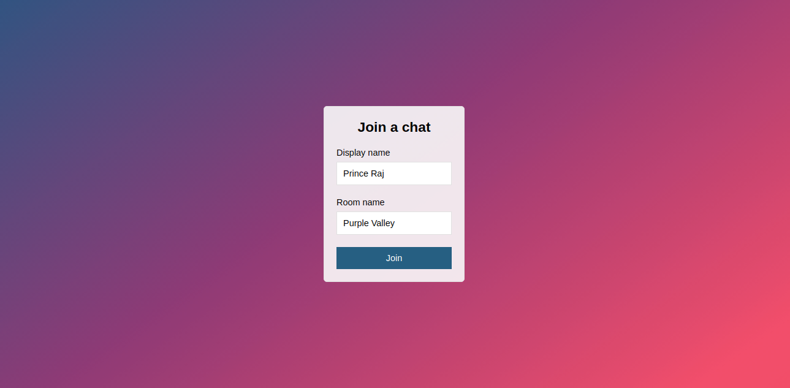

# node-chat-app
## Join a room

## Demo Chat

## Deployed to Heroku
> Install heroku
- sudo snap install --classic heroku
- heroku create
- git push heroku main
- <a href="https://quiet-coast-00336.herokuapp.com/" target="_blank">Open App</a>

Happy Coding !!